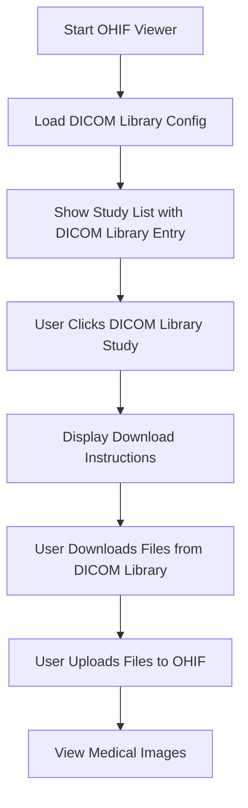

# 🏥 DICOM Library Integration Guide

## 🎯 Overview

This guide explains how to integrate DICOM data from [dicomlibrary.com](https://www.dicomlibrary.com/?manage=daae3df7f522b56724aed7e3e544c0fe) with your OHIF Medical Imaging Viewer project.

---

## 🚨 **Important Note About DICOM Library**

**DICOM Library does NOT provide a standard DICOMweb API.** The platform requires manual download of DICOM files. Here's what I've set up for you:

### ✅ **What I've Created:**
1. **Custom Configuration** (`config/dicomlibrary.js`)
2. **Custom Data Source Extension** (`extensions/dicom-library-datasource/`)
3. **Integration Instructions** (this guide)

### ❌ **What Won't Work Directly:**
- Direct API access to DICOM Library
- Automatic image loading from the URL
- Standard DICOMweb endpoints

---

## 🔧 **How to Use DICOM Library Data**

### **Method 1: Manual Download + Local File Loader (Recommended)**

1. **Visit the DICOM Library URL:**
   ```
   https://www.dicomlibrary.com/?manage=daae3df7f522b56724aed7e3e544c0fe
   ```

2. **Download DICOM Files:**
   - Look for download buttons or links on the page
   - Download individual `.dcm` files or ZIP archives
   - Save to your local computer

3. **Load into OHIF Viewer:**
   - Open your OHIF viewer: `http://localhost:3000`
   - Use the "Load Local Files" option
   - Drag and drop the downloaded DICOM files
   - Or use the file picker to select files

### **Method 2: Use Custom Configuration**

1. **Start with DICOM Library Config:**
   ```bash
   cd platform/app
   APP_CONFIG=config/dicomlibrary.js yarn dev
   ```

2. **The viewer will show:**
   - A placeholder study entry for the DICOM Library data
   - Instructions to download files manually
   - Link to the original DICOM Library URL

---

## 📁 **File Structure Created**

```
your-ohif-project/
├── platform/app/public/config/
│   └── dicomlibrary.js                    # Custom config for DICOM Library
├── extensions/dicom-library-datasource/
│   ├── package.json
│   └── src/
│       ├── index.js                       # Main extension file
│       ├── id.js                          # Extension ID
│       ├── getDataSourcesModule.js        # Data sources module
│       └── DicomLibraryDataSource/
│           └── index.js                   # Custom data source implementation
└── DICOM_LIBRARY_INTEGRATION.md          # This guide
```

---

## 🎛️ **Configuration Details**

### **Custom Data Source Features:**
- **Study Placeholder**: Shows DICOM Library study in study list
- **Download Instructions**: Provides guidance for manual download
- **URL Linking**: Direct links to original DICOM Library page
- **Fallback Support**: Falls back to default AWS data sources

### **Configuration Options:**
```javascript
// In config/dicomlibrary.js
dataSources: [
  {
    sourceName: 'dicomlibrary',
    configuration: {
      friendlyName: 'DICOM Library',
      customStudies: [
        {
          studyInstanceUID: 'dicomlibrary.daae3df7f522b56724aed7e3e544c0fe',
          url: 'https://www.dicomlibrary.com/?manage=daae3df7f522b56724aed7e3e544c0fe',
          // ... other study metadata
        }
      ]
    }
  }
]
```

---

## 🚀 **Usage Instructions**

### **Step 1: Start the Viewer**
```bash
cd platform/app
APP_CONFIG=config/dicomlibrary.js yarn dev
```

### **Step 2: Access the Viewer**
Open your browser to: `http://localhost:3000`

### **Step 3: You'll See:**
- Study list with DICOM Library entry
- Instructions for downloading files
- Link to original DICOM Library URL

### **Step 4: Download and Load**
1. Click the DICOM Library URL
2. Download the DICOM files
3. Return to OHIF viewer
4. Use "Load Local Files" or drag-and-drop

---

## 🔄 **Alternative Approaches**

### **Option A: Direct File Upload**
```javascript
// If you have the DICOM files locally
const fileInput = document.createElement('input');
fileInput.type = 'file';
fileInput.multiple = true;
fileInput.accept = '.dcm,.dicom';
fileInput.onchange = (event) => {
  const files = event.target.files;
  // Load files into OHIF viewer
};
```

### **Option B: Proxy Server (Advanced)**
If you want to create a proxy server to handle DICOM Library access:

```javascript
// Custom proxy server (Node.js/Express)
app.get('/api/dicomlibrary/:studyId', async (req, res) => {
  const studyId = req.params.studyId;
  // Implement custom logic to fetch from DICOM Library
  // Convert to DICOMweb format
  // Return standardized response
});
```

### **Option C: Browser Extension (Advanced)**
Create a browser extension that:
1. Detects DICOM Library pages
2. Extracts DICOM file URLs
3. Provides direct download links
4. Integrates with OHIF viewer

---

## 🛠️ **Development Extensions**

### **Adding More DICOM Library Studies:**
```javascript
// In config/dicomlibrary.js
customStudies: [
  {
    studyInstanceUID: 'dicomlibrary.daae3df7f522b56724aed7e3e544c0fe',
    url: 'https://www.dicomlibrary.com/?manage=daae3df7f522b56724aed7e3e544c0fe',
    studyDescription: 'DICOM Library Study 1',
    // ... metadata
  },
  {
    studyInstanceUID: 'dicomlibrary.another-study-id',
    url: 'https://www.dicomlibrary.com/?manage=another-study-id',
    studyDescription: 'DICOM Library Study 2',
    // ... metadata
  }
]
```

### **Custom UI Components:**
You can create custom UI components to:
- Display download instructions
- Show progress during file loading
- Provide direct links to DICOM Library
- Handle batch file uploads

---

## 🔍 **Troubleshooting**

### **Common Issues:**

1. **"No studies found"**
   - Check if you're using the correct config: `APP_CONFIG=config/dicomlibrary.js`
   - Verify the DICOM Library URL is accessible

2. **"CORS errors"**
   - This is expected for direct API access
   - Use the manual download method instead

3. **"Files won't load"**
   - Ensure downloaded files are valid DICOM format
   - Check file extensions (.dcm, .dicom)
   - Try different browsers

4. **"Extension not found"**
   - Make sure the custom extension is properly installed
   - Check the extension path in your configuration

### **Debug Mode:**
```bash
# Start with debug logging
DEBUG=* APP_CONFIG=config/dicomlibrary.js yarn dev
```

---

## 📊 **Expected Workflow**



---

## 🎯 **Next Steps**

1. **Test the Integration:**
   - Start viewer with DICOM Library config
   - Verify study appears in study list
   - Test download workflow

2. **Customize as Needed:**
   - Add more DICOM Library studies
   - Modify UI components
   - Enhance download instructions

3. **Consider Automation:**
   - Create scripts for batch downloads
   - Build browser extensions
   - Develop proxy servers

---

## 💡 **Tips for Success**

- **Always download files manually** from DICOM Library first
- **Use the local file loader** for best compatibility
- **Check file formats** - ensure they're valid DICOM
- **Test with small datasets** before loading large studies
- **Keep files organized** by study/series for easier loading

---

**🎉 Your OHIF viewer is now configured to work with DICOM Library data!**

The integration provides a bridge between DICOM Library's manual download process and OHIF's powerful viewing capabilities.